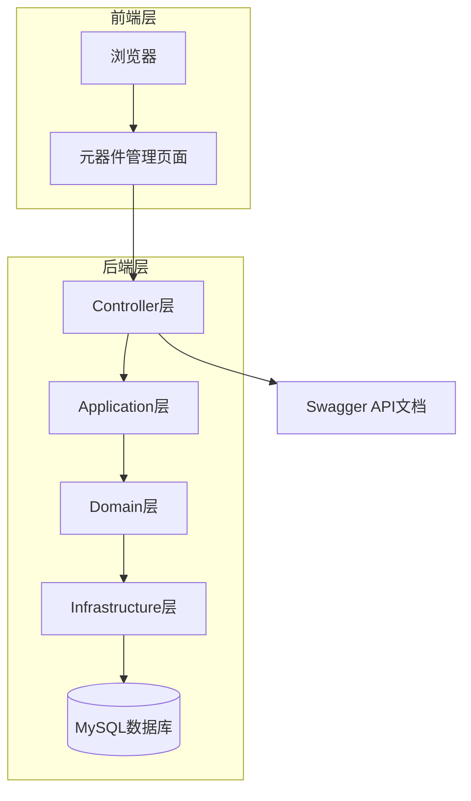
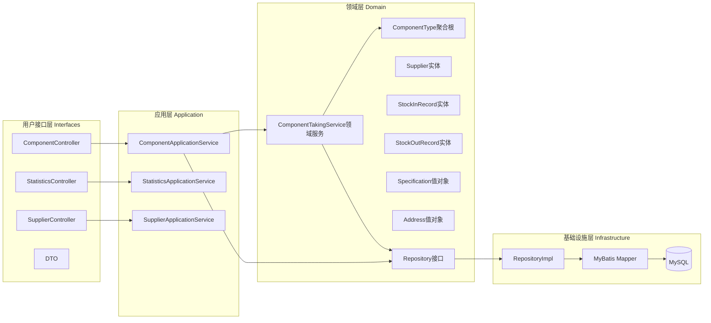
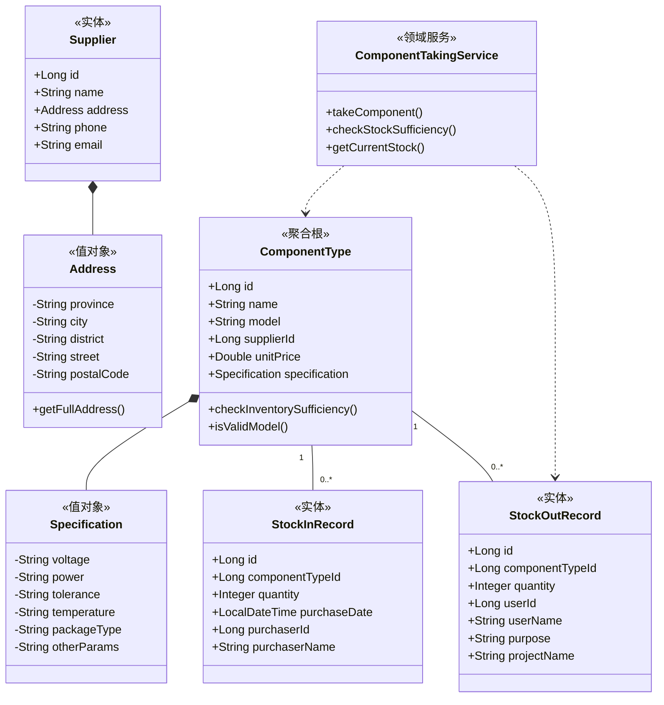
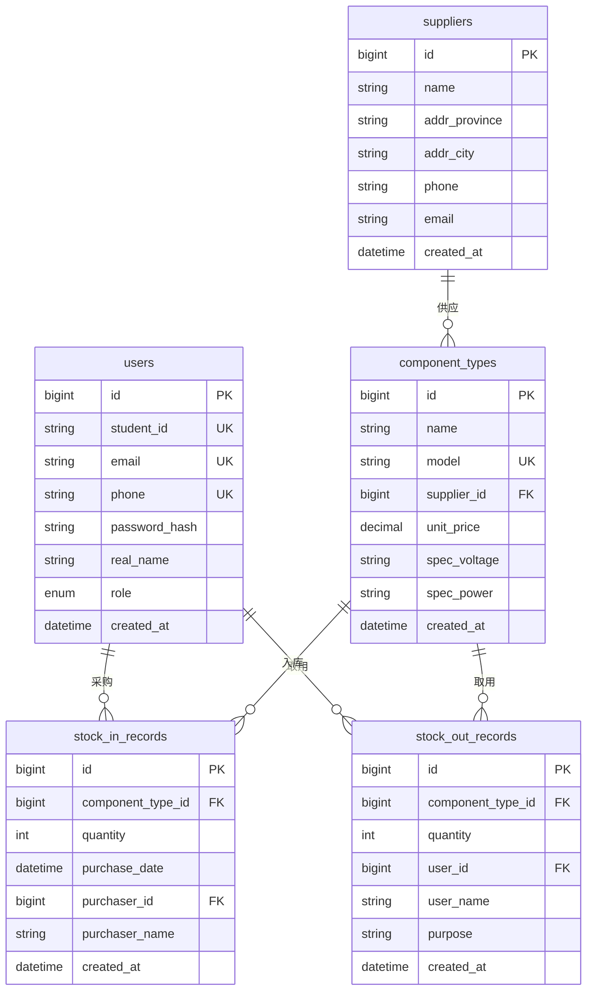
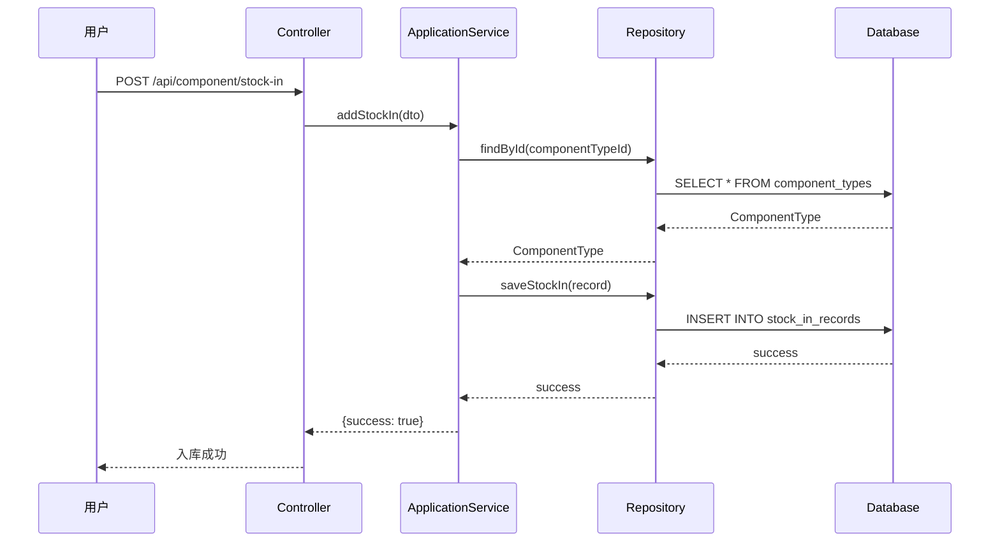
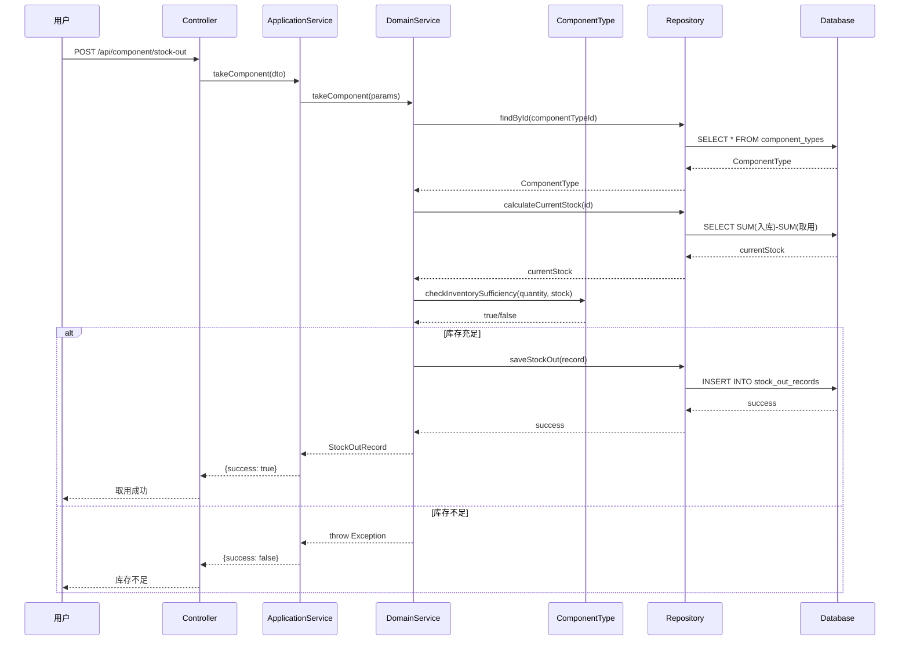
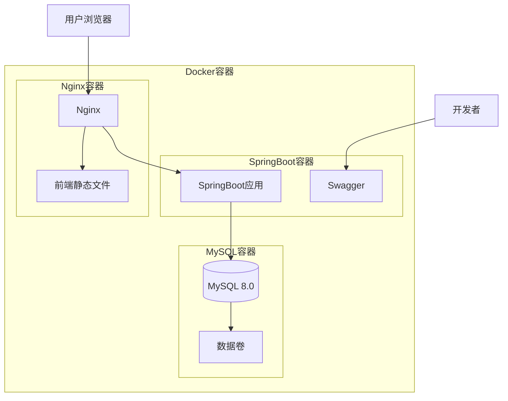
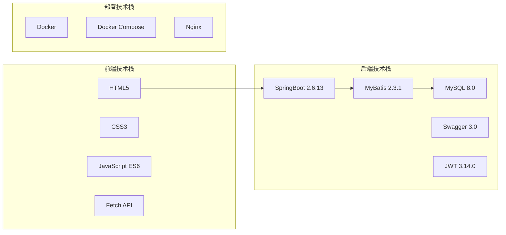

# 元器件管理系统 - 架构图

## 1. 系统整体架构



## 2. DDD分层架构



## 3. 领域模型图



## 4. 数据库E-R图



## 5. 业务流程图

### 5.1 入库流程



### 5.2 取用流程



## 6. 部署架构图



## 7. 技术栈架构



## 8. 包结构图

```
com.gok.demos
├── domain                          # 领域层
│   ├── entity                      # 实体
│   │   ├── ComponentType.java      # 聚合根
│   │   ├── Supplier.java
│   │   ├── StockInRecord.java
│   │   └── StockOutRecord.java
│   ├── valueobject                 # 值对象
│   │   ├── Specification.java
│   │   └── Address.java
│   ├── repository                  # 仓储接口
│   │   ├── ComponentTypeRepository.java
│   │   ├── StockRecordRepository.java
│   │   └── SupplierRepository.java
│   └── service                     # 领域服务
│       └── ComponentTakingService.java
├── application                     # 应用层
│   ├── ComponentApplicationService.java
│   ├── SupplierApplicationService.java
│   └── StatisticsApplicationService.java
├── interfaces                      # 接口层
│   ├── controller
│   │   ├── ComponentController.java
│   │   ├── StatisticsController.java
│   │   └── SupplierController.java
│   └── dto
│       ├── ComponentTypeDTO.java
│       ├── StockInDTO.java
│       ├── StockOutDTO.java
│       └── SupplierDTO.java
└── infrastructure                  # 基础设施层
    └── persistence
        ├── ComponentTypeRepositoryImpl.java
        ├── StockRecordRepositoryImpl.java
        ├── SupplierRepositoryImpl.java
        └── mapper
            ├── ComponentTypeMapper.java
            ├── StockRecordMapper.java
            └── SupplierMapper.java
```

